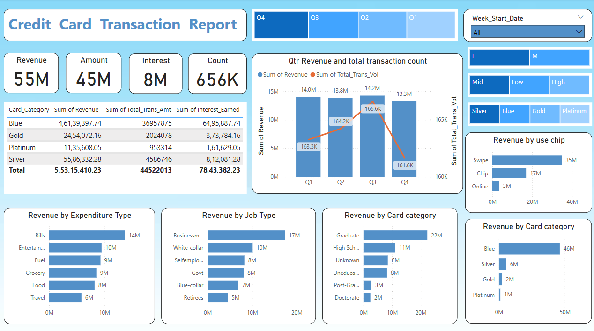

# Credit Card Transaction Dashboard

This **Credit Card Transaction Dashboard** provides comprehensive insights into customer transaction data. The dashboard is built using **Power BI** and connected to a **PostgreSQL** database containing detailed credit card transaction and customer information. The dashboard helps analyze key metrics like total spending, customer acquisition costs, credit limits, and more.

## **Project Overview**

The project visualizes key data points from two main datasets:

1. **Credit Card Details** (`cc_detail`): Includes transaction data, card categories, customer behavior, and more.
2. **Customer Details** (`cust_detail`): Contains demographic information like customer age, income, marital status, etc.

### **Key Features:**
- **Interactive Dashboard**: Provides filters to segment data by customer demographics and transaction behavior.
- **Visual Insights**: Allows users to analyze the total transactions, annual fees, credit limits, delinquency, and other critical metrics.
- **Data Transformation**: Uses Power BI’s built-in tools to clean, transform, and visualize data from a PostgreSQL database.

---

## **Technologies Used:**
- **PostgreSQL**: Database for storing and managing credit card and customer data.
- **Power BI**: Data visualization tool to build interactive reports and dashboards.
- **SQL**: Used to create and manage database tables and import CSV data.

---

## **Getting Started**

### **Prerequisites:**
1. **PostgreSQL Database** with `cc_detail` and `cust_detail` tables populated.
2. **Power BI Desktop** installed on your machine.
3. **CSV files** for importing data into the database.

### **Steps to Setup:**
1. Clone or download this repository.
2. Set up **PostgreSQL** and create the `ccdb` database using the provided SQL queries.
3. Import the **CSV files** into PostgreSQL using the `COPY` command (see SQL code below).
4. Connect **Power BI** to your PostgreSQL database.
5. Load data into Power BI, clean and transform it.
6. Start exploring the interactive dashboard.

---
